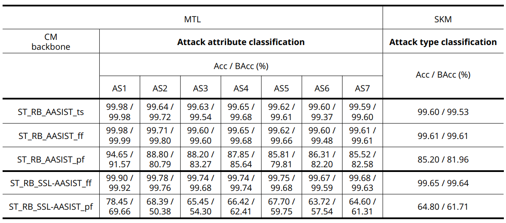
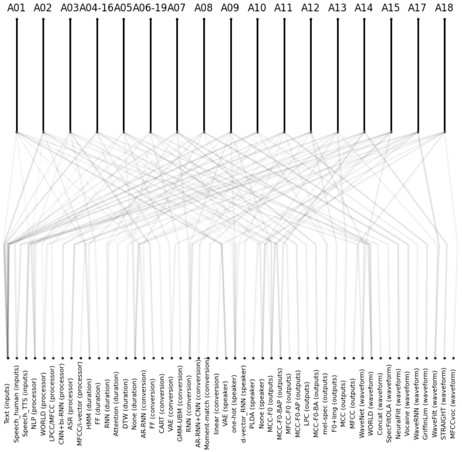
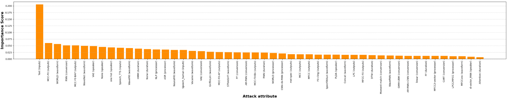
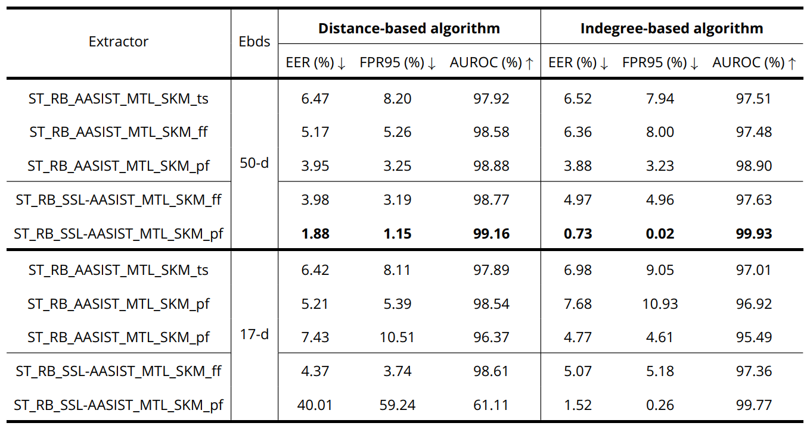

<h2 align="center">Kolmogorov–Arnold Network-based Model for Interpretable and Adaptive Speech Deepfake Source Tracing</h2>


## Updates

- 2025/11/29: Complete experiments relating to Interpretability are online.
- 2025/11/27: The official implementation has been open-sourced.

## Table of Contents

- [Technical Briefing 💡](#)
- [Main Results 🏆](#)
  - [1. Source tracing tasks](#)
  - [2. Interpretability validation](#)
  - [3. Adaptability to deepfake detection](#)
- [Quick Start 🚀](#)

## Technical Briefing 💡

**Introducing proposed model** - the next generation of speech deepfake source tracing system with interpretability and adaptability.  

* **CM_MTL_KAN: A combination of countermeasure based Multi-task Learning and Kolmogorov-Arnold Network**

  * Two architectures of deepfake detection model, namely AASIST and SSL-AASIST, are used as backbones for audio representation learning.
  * Performs two main source tracing tasks: (1) attack attribute classification and (2) attack type classification.
  * Three training strategies are (1) training from scratch, (2) full finetuning and (3) partial finetuning.

* **Intepretability mechanism: A transparency using both Intrinsic and Extrinsic factors**

  * Intrinsic interpretability: an integration in KAN with the auxiliary structure obtained from metadata of ASVspoof2019-attr-17 protocol in ASVspoof 2019 LA dataset. 
  * Extrinsic interpretability: a KAN's built-in mechanism for input feature importance analysis. 
  * Feature importance results are validated using three criteria: (1) consistency, (2) stability and (3) faithfulness.
 
* **OOD detection: An adaptability from source tracing to deepfake detection**

  * Two kinds of embeddings are extracted: (1) attack attribute embeddings and (2) attack classification embeddings.
  * Evaluating how discriminative embeddings are between spoofed speech (In-distribution samples) and bonafide speech (Out-of-distribution samples).
  * Two algorithms are used: (1) OOD Detection with Deep Nearest Neighbors (distance-based) and (2) OOD Detection using indegree number in directed kNN graph (in-degree based)       

## Main Results 🏆

### Experiment 1: Source tracing performance
Table 1: Performance of our proposed source tracing model on ASVspoof2019-attr-17 protocol of ASVspoof 2019 LA dataset. 


### Experiment 2: Interpretability validation

#### Intrinsic interpretability
A visualization of structured KAN module that presents the relations between attack attributes and attack types in ASVspoof 2019 LA dataset.


#### Extrinsic interpretability
A bar plot shows the global importance scores of each attack attribute that affects the performance of attack type classification.



### Experiment 3: Adaptability to deepfake detection
Table 2: Performance of OOD detection. 


## Quick Start 🚀

### 1. Install Dependencies

```
git clone https://github.com/HoangHPham/KAN-Deepfake-Tracing.git
cd KAN-Deepfake-Tracing
conda create -n sourceTracing python=3.12
conda activate sourceTracing
pip install -r requirements.txt
```

### 2. Data preparation 

- Download **ASVspoof 2019 LA dataset** at [ASVspoof2019](https://datashare.ed.ac.uk/handle/10283/3336).
- Two data protocols, i.e., **ASVspoof2019-attr-2** and **ASVspoof2019-attr-17**, are available at `./data`.
- 🔥 Modify data paths in configurations files:

`./data/ASVspoof2019_LA_cm.yaml`
``` code
# ASVspoof2019-attr-2 protocol
train_dataset_path: <DATADIR>/asvspoof2019/LA/ASVspoof2019_LA_train
dev_dataset_path: <DATADIR>/asvspoof2019/LA/ASVspoof2019_LA_dev
eval_dataset_path: <DATADIR>/asvspoof2019/LA/ASVspoof2019_LA_eval 

train_protocol_path: ./data/ASVspoof2019_LA_cm_protocols/ASVspoof2019.LA.cm.train.trn.txt
dev_protocol_path: ./data/ASVspoof2019_LA_cm_protocols/ASVspoof2019.LA.cm.dev.trl.txt
eval_protocol_path: ./data/ASVspoof2019_LA_cm_protocols/ASVspoof2019.LA.cm.eval.trl.txt
```

`./data/ASVspoof2019_attr17_cm.yaml`
``` code
# ASVspoof2019-attr-17 protocol
train_dataset_path: <DATADIR>/asvspoof2019/asvspoof2019_attr17/ASVspoof2019_attr17_train
dev_dataset_path: <DATADIR>/asvspoof2019/asvspoof2019_attr17/ASVspoof2019_attr17_dev
eval_dataset_path: <DATADIR>/asvspoof2019/asvspoof2019_attr17/ASVspoof2019_attr17_eval

train_protocol_path: ./data/ASVspoof2019_attr17_cm_protocols/Train_ASVspoof19_attr17.txt 
dev_protocol_path: ./data/ASVspoof2019_attr17_cm_protocols/Dev_ASVspoof19_attr17.txt
eval_protocol_path: ./data/ASVspoof2019_attr17_cm_protocols/Eval_ASVspoof19_attr17.txt 
```

- For data pre-processing, both silence trimming and RawBoost augmentation are used as default. See `./data_utils.py` for more details. 

### 3. Training

- 🔥 Modify hyper-parameters in `./config/train.yaml`. Some importances:

``` code
# model config
backbone: # AASIST or SSLAASIST
use_pretrained_backbone: # True if using pretrained weights for backbone
freeze_backbone: # True if freezing backbone
use_kan_auxiliary_structure: # True if using auxiliary structure for KAN module

# Resume pretrained weights
resume: # True if training from a pretrained weights
pretrained_ppm_path: # requiring a path for pretrained proposed model if resume=True

# data pre-processing
trim_silence: # True if trimming silence segments in input audio 
```

- 🔥 **Note:** if `use_pretrained_backbone=True`, pretrained weights of backbone are required. [AASIST](https://github.com/clovaai/aasist) or [SSL-AASIST](https://github.com/TakHemlata/SSL_Anti-spoofing) should be trained first for deepfake detection task to get the pretrained weights. 

- To run a training:
``` code
python train.py
```

### 4. Validation

- 🔥 Modify hyper-parameters in `./config/evaluate.yaml` (most are similar to training configurations):

``` code
# model config
...
pretrained_weights_path: <path to trained weights>

# ...
```

- To run an evaluation:
``` code
python evaluation.py
```

### 5. Interpretability

🔥 **Note:** Complete experiments relating to interpretability are provided in `./experiments/Interpretability.ipynb`. Following sub-sections are only quick guides. 

#### 5.1. Intrinsic interpretability

To visualize the intrinsic structure of KAN module (SKM) that is intergrated with auxiliary tree structure from metadata of ASVspoof 2019 LA dataset:

* Step 1: Get SKM from trained proposed model
  * **Note:** To ensure that it is possible to feed the entire evaluation set as a single batch (global inference) into the SKM, it is required to extract attack attribute embeddings from MTL module first and then feed these embeddings into SKM.
  * Step 1.1: Extract attack attribute embeddings
  ``` code
  python feature_extraction.py --prot-attr17 True --phase eval --exp-name <saved-folder>
  ```   
  * Step 1.2: Get SKM architecture
  ``` code
  device = torch.device("cuda" if torch.cuda.is_available() else "cpu")
  pretrained_path = "./weights/best.pt"
  model = CMMTLKAN(
                  backbone="AASIST", # or SSLAASIST
                  use_pretrained_backbone=False,
                  freeze_backbone=False,
                  device=device, 
                  kan_auxiliary_structure=ASVSpoof2019_Attr17_attack_attribute_structure,
                  seed=42
              ).to(device)
  model.load_state_dict(torch.load(pretrained_path, map_location=device))

  kan_module = model.kan_module
  kan_module.to(device)
  ```
  * Step 1.3: Feed embeddings extracted in step 1.1 into SKM as a single batch
  ``` code
  from data_utils import ASVSpoof2019_Attr17_attack_attribute_structure
  from model import CMMTLKAN
  from FI_utils import *
  ```
  ``` code
  embds_folder = "./extracted_embds"
  exp_name = <saved-folder>
  exp_folder = os.path.join(embds_folder, exp_name)
  eval_attackAttr_embeddings_file = "ASVspoof2019_attr17_eval_attackAttr_embeddings.npy"
  eval_attackAttr_embeddings_path = os.path.join(exp_folder, eval_attackAttr_embeddings_file)

  eval_attackAttr_embeddings = np.load(eval_attackAttr_embeddings_path)
  eval_protocols_path = './data/ASVspoof2019_attr17_cm_protocols/Eval_ASVspoof19_attr17.txt'
  eval_attack_labels = load_attack_labels(eval_protocols_path)

  eval_dataset = AttClsDataset(eval_attackAttr_embeddings, eval_attack_labels)

  eval_loader = DataLoader(eval_dataset,
                             batch_size=len(eval_dataset),
                             shuffle=False,
                             drop_last=False,
                             pin_memory=True,
                             collate_fn=None,
                             num_workers=4)
  
  eval_avg_acc, eval_avg_balanced_acc, attCls_cfsMatrix, attCls_clsReport = eval_AttackCls(eval_loader, kan_module, device)
  ```
* Step 2: Visualize tree structure of SKM
``` code
in_vars=["Text (inputs)", "Speech_human (inputs)", "Speech_TTS (inputs)",
         "NLP (processor)", "WORLD (processor)", "LPCC/MFCC (processor)", "CNN+bi-RNN (processor)", "ASR (processor)", "MFCC/i-vector (processor)",
         "HMM (duration)", "FF (duration)", "RNN (duration)", "Attention (duration)", "DTW (duration)", "None (duration)", 
         "AR-RNN (conversion)", "FF (conversion)", "CART (conversion)", "VAE (conversion)", "GMM-UBM (conversion)", "RNN (conversion)", "AR-RNN+CNN (conversion)", "Moment-match (conversion)", "linear (conversion)",
         "VAE (speaker)", "one-hot (speaker)", "d-vector_RNN (speaker)", "PLDA (speaker)", "None (speaker)", 
         "MCC-F0 (outputs)", "MCC-F0-BAP (outputs)", "MFCC-F0 (outputs)", "MCC-F0-AP (outputs)", "LPC (outputs)", "MCC-F0-BA (outputs)", "mel-spec (outputs)", "F0+ling (outputs)", "MCC (outputs)", "MFCC (outputs)",
         "WaveNet (waveform)", "WORLD (waveform)", "Concat (waveform)", "SpecFiltOLA (waveform)", "NeuralFilt (waveform)", "Vocaine (waveform)", "WaveRNN (waveform)", "GriffinLim (waveform)", "WaveFilt (waveform)", "STRAIGHT (waveform)", "MFCCvoc (waveform)"
        ]
out_vars=['A01', 'A02', 'A03', 'A04-16', 'A05', 'A06-19', 'A07', 'A08', 'A09', 'A10', 'A11', 'A12', 'A13', 'A14', 'A15', 'A17', 'A18']

kan_module.plot(beta=3, scale=1, varscale=0.2, in_vars=in_vars, out_vars=out_vars)
```

#### 5.2. Extrinsic interpretability

* At the model level, to get importance scores for input features of structured KAN module (SKM), use `kan_module.feature_score` attribution of KAN:
``` code
feature_scores = kan_module.feature_score
```
* At the per-class level, to get importance scores for input features corresponding to a specific output in structured KAN module (SKM), use `kan_model.attribute(1, outNode_id)` function, where `outNode_id` ranges from 0 to 16 (17 attack types). For example, to get important scores of attributes in attack type A01:
``` code
feature_scores = kan_model.attribute(1, 0)
```

#### 5.3. Feature importance validation
🔥 For experiments relating to evaluation of feature importance results, full implementations can be reproducible using `./experiments/Interpretability.ipynb`.

### 6. OOD detection

* Step 1: Extract embeddings
  * OOD detection problems require three kinds of samples: (1) train in-distribution (spoofed), (2) dev/test in-distribution (spoofed), and (3) test out-of-distribution (bonafide). Each kind consists of 2 types of embeddings: (1) attack attribute embeddings (50-d) and (2) attack classification embeddings.
  * Embeddings for in-distribution samples can be extracted:
  ``` code
  python feature_extraction.py --prot-attr17 True --phase train --exp-name <saved-folder>
  python feature_extraction.py --prot-attr17 True --phase dev --exp-name <saved-folder>
  python feature_extraction.py --prot-attr17 True --phase eval --exp-name <saved-folder>
  ```
  * Embeddings for out-of-distribution can be extracted:
  ``` code
  python feature_extraction.py --prot-attr17 False --exp-name <saved-folder>
  ```
* Step 2: Run OOD detection algorithms
  * 🔥 **Note:** Investigate `./evaluate_deepfake_detection.py` to manually config which embeddings are used for OOD detection algorithms.
  ``` code
  python evaluate_deepfake_detection.py
  ```

### 7. Additional experiments

### 7.1. Baseline models

### 7.2. Ablations

## Acknowledgements
Very thanks to authors who have foundations for my implementations:
1. [Official AASIST by @clovaai](https://github.com/clovaai/aasist)
2. [Official SSL-AASIST by @TakHemlata](https://github.com/TakHemlata/SSL_Anti-spoofing)
3. [Official KAN by @KindXiaoming](https://github.com/KindXiaoming/pykan)
4. [Baseline source tracing model by @Manasi2001](https://github.com/Manasi2001/Spoofed-Speech-Attribution)


